\<div align="center"\>

# \<h1\>\<b\>Distributed System Health Monitor\</b\>\</h1\>

\<p\>
A Docker-powered monitoring system where lightweight agents collect health data (CPU, RAM, Disk) from multiple computers and send it to a central server for real-time tracking and analysis.
\</p\>

\
\
\
\

\</div\>

-----

### **🗺️ Table of Contents**

  * [About The Project](https://www.google.com/search?q=%23-about-the-project)
  * [Key Features](https://www.google.com/search?q=%23-key-features)
  * [Architecture](https://www.google.com/search?q=%23%EF%B8%8F-architecture)
  * [Tech Stack](https://www.google.com/search?q=%23-tech-stack)
  * [Getting Started](https://www.google.com/search?q=%23-getting-started)
  * [Usage](https://www.google.com/search?q=%23-usage)
  * [Future Improvements](https://www.google.com/search?q=%23-future-improvements)

-----

### **📖 About The Project**

This project simulates a professional Site Reliability Engineering (SRE) observability pipeline. It demonstrates how to build a resilient, multi-node system for collecting and processing health metrics from a distributed environment. The entire application stack is containerized using Docker and orchestrated with Docker Compose, making it easy to deploy, scale, and manage.

-----

### **✨ Key Features**

  * **Go-Powered Agent:** A highly efficient, low-overhead agent for collecting system metrics.
  * **Resilient Data Pipeline:** Uses RabbitMQ as a message broker to reliably queue data from all agents.
  * **Centralized Processor:** A Python service that consumes and processes incoming metrics.
  * **AI Help Desk:** A FastAPI API that provides predefined solutions for known error patterns.
  * **Multi-Node Simulation:** Docker Compose orchestrates the entire system, simulating a real-world distributed setup.

-----

### **⚙️ Architecture**

The system uses a decoupled, message-driven architecture for high scalability and resilience.

```mermaid
graph TD
    subgraph Monitored Nodes
        Agent1[Go Agent on Node 1]
        Agent2[Go Agent on Node 2]
        Agent3[Go Agent on Node 3]
    end

    subgraph Central Services
        MQ[RabbitMQ Message Queue]
        Processor[Python Processor]
        AIAssistant[🤖 AI Recovery Assistant]
    end

    Agent1 --> MQ
    Agent2 --> MQ
    Agent3 --> MQ

    MQ --> Processor
```



-----

### **🛠️ Tech Stack**

| Category          | Technology / Library      |
| ----------------- | ------------------------- |
| **Agent** | Go, `gopsutil`            |
| **Processing** | Python, `pika`            |
| **API** | Python, `FastAPI`         |
| **Message Queue** | RabbitMQ                  |
| **Containerization**| Docker & Docker Compose   |

-----

### **🚀 Getting Started**

Follow these steps to get your local copy up and running.

#### **Prerequisites**

You only need one thing installed:

  * **Docker & Docker Compose** - [Download and Install Here](https://docs.docker.com/get-docker/)

#### **Installation & Running**

1.  **Clone the repository:**
    ```bash
    git clone https://github.com/your-username/your-repository-name.git
    cd your-repository-name
    ```
2.  **Build and Launch the System:**
    This one command builds and starts all services in the background.
    ```bash
    docker-compose up --build -d
    ```

-----

### **🔬 Usage**

Once the system is running, you can monitor it in a few ways:

1.  **View Live Logs:**
    See the real-time output from all services. You'll see agents sending metrics and the processor receiving them.
    ```bash
    docker-compose logs -f
    ```
2.  **Open the RabbitMQ Dashboard:**
    This is the main control panel for your data pipeline.
      * **URL:** `http://localhost:15672`
      * **Login:** `guest` / `guest`
3.  **Test the AI Assistant API:**
    Check if the API is online.
      * **URL:** `http://localhost:8000`

#### **Stopping the System**

To stop and remove all running containers, simply run:

```bash
docker-compose down
```

-----

### **💡 Future Improvements**

  * **📊 Grafana Dashboard:** Add Grafana for a rich, visual dashboard of all metrics.
  * **🗄️ Persistent Storage:** Integrate Prometheus for metrics and Elasticsearch for logs.
  * **🔔 Alerting:** Use Prometheus Alertmanager to send notifications on critical events.
  * **🤖 Automated Remediation:** Allow the AI Assistant to trigger automated fixes for common errors.
